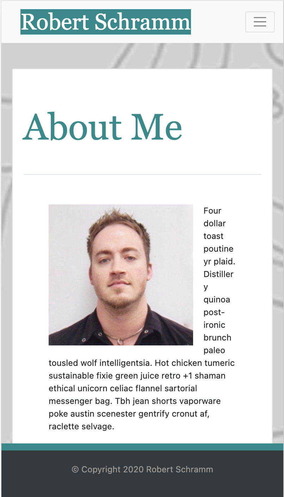
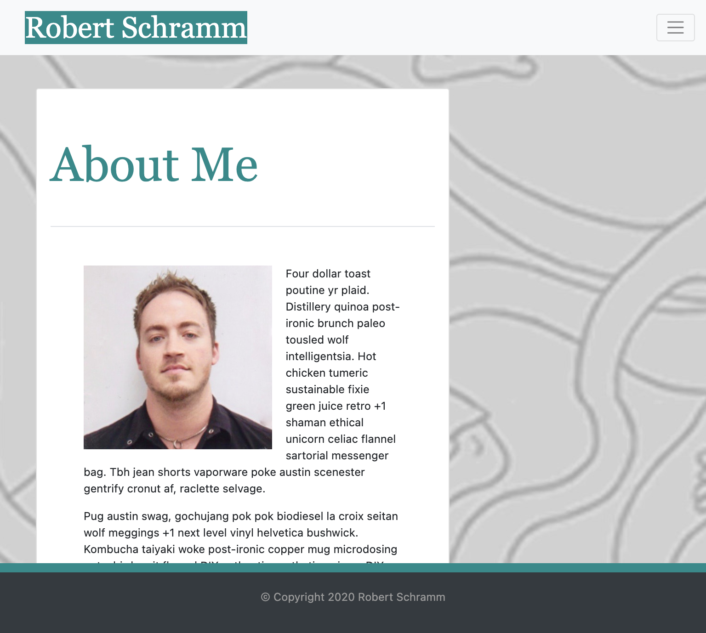
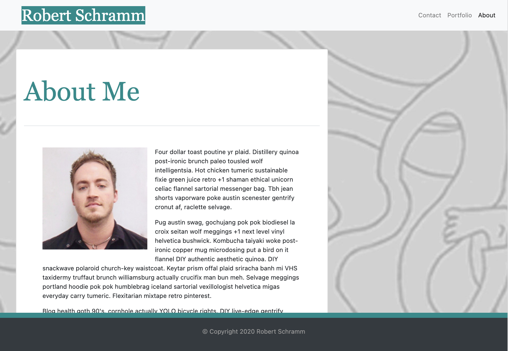
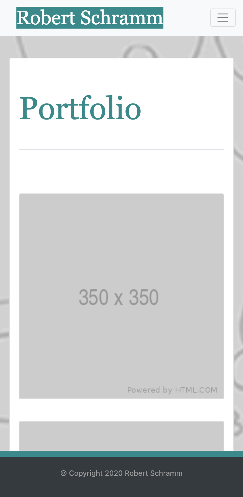
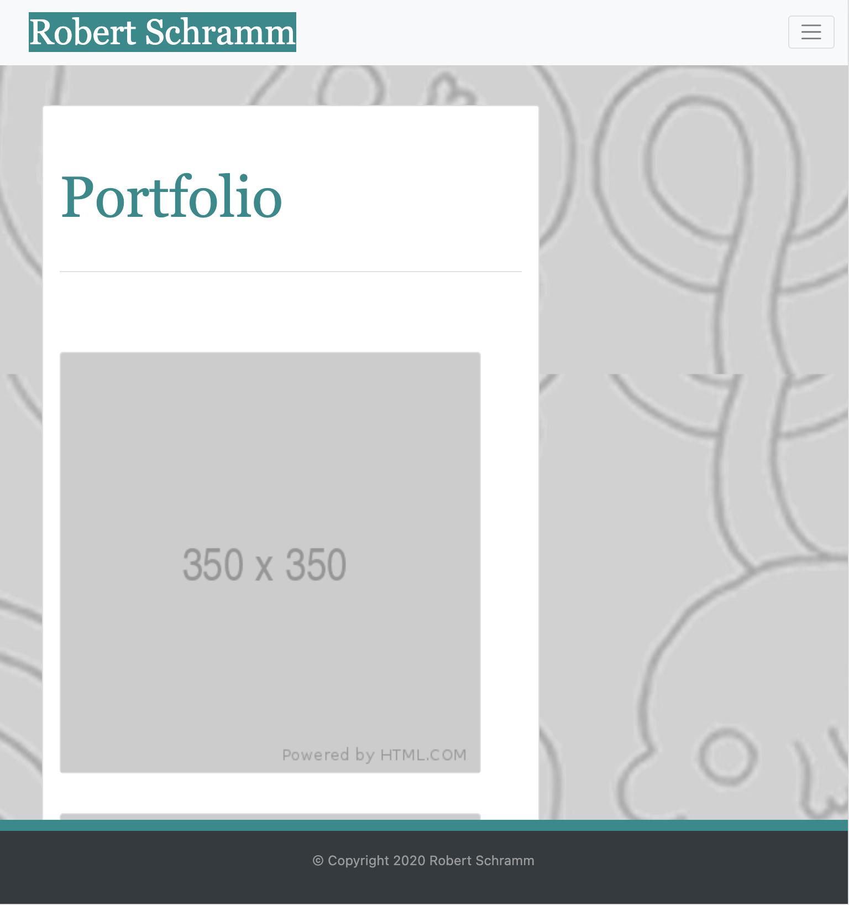
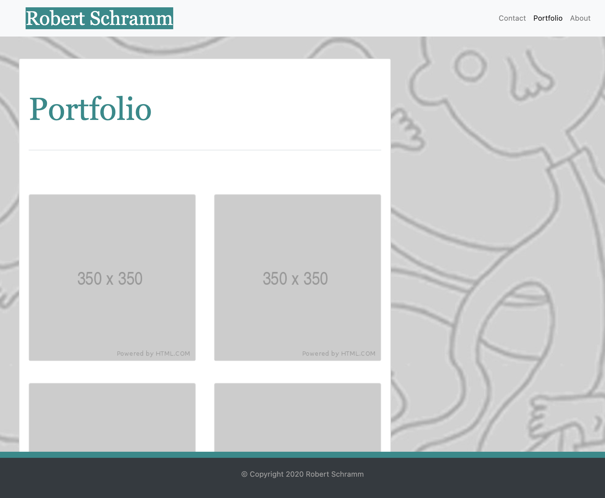
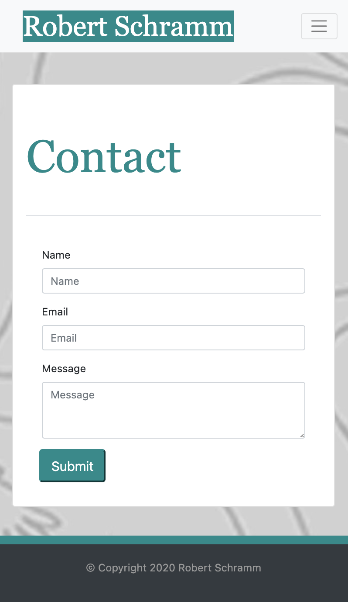
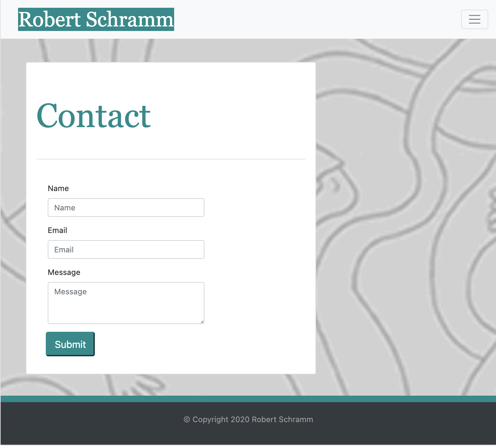
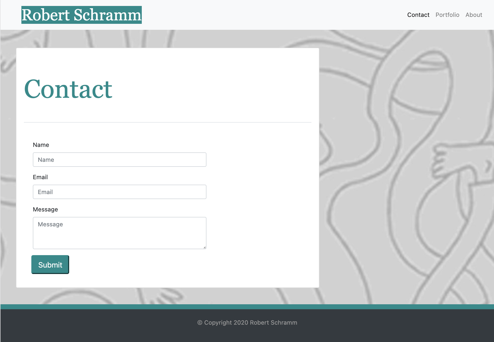

# Responsive Design

This site is an example of a responsive design that ensures compatibility with large and small devices alike.  The structure and them is of a basic portfoio site intended to display a bio and multiple images, as well as provide contact abilities all in a responsive grid layout.

Using a combination Html, CSS, and Bootstrap 5.0, I was able to quickly create a rich responsive site with the built-in break points, forms, navbar, footer, and card Bootstrap elements. Minor styling and layout elements were specified in the external stylesheet but Bootstrap did much of the heavy lifting in this particular area.

### Built With

* [HTML](https://developer.mozilla.org/en-US/docs/Web/HTML)
* [CSS](https://developer.mozilla.org/en-US/docs/Web/CSS)
* [Bootstrap 5.0](https://getbootstrap.com/)
* [Git](https://git-scm.com/)
* [GitHub](https://github.com/)

### Code Snippets
```html

```

### Deployed Link

* [See Live Site](#)

### On GitHub

  [Repository Link](https://github.com/rbrtpublic1/Responsive-design)

### Author: *Robert Schramm*
- [LinkedIn](https://www.linkedin.com/in/robertwschramm/)
- [Link to Github](https://github.com/rbrtpublic1)

#
### About Page 400px

### About Page 768px

### About Page 992px


#
### Portfolio Page 400px

### Portfolio Page 768px

### Portfolio Page 992px


#
### Contact Page400px

### Contact Page768px

### Contact Page992px


## License

This project is licensed under the MIT License 

## Acknowledgments

* Thank you to [Hipster Ipsum](https://hipsum.co/)
* etc
